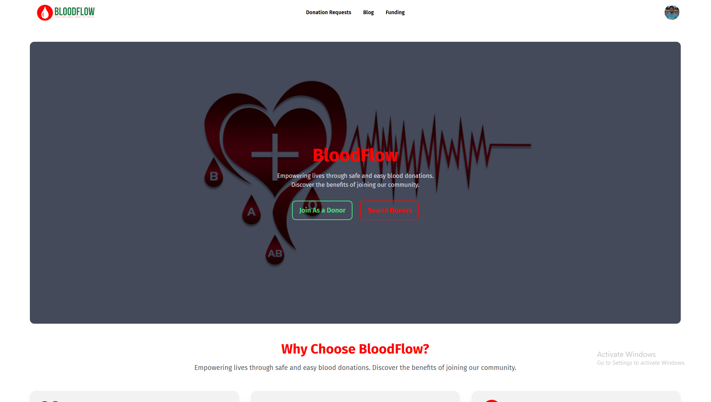

# BloodFlow (Every Drop Counts, Every Life Thrives)

[](https://your-live-site.com)

## Overview
BloodFlow is a MERN stack-based Blood Donation Application designed to connect blood donors with recipients efficiently. It features donor registration, blood donation requests, donor management, content management, and role-based access control to ensure a seamless and secure experience. Built with React, Node.js, Express, and MongoDB, the platform enables easy authentication, real-time updates, and streamlined donation processes. "Every Drop Counts, Every Life Thrives."

### Admin Credentials:
- **Username:** sheikhmuhammadantor@gmail.com
- **Password:** Muhammad

### Live Site URL:
[bloodflow.com](https://bloodflow.netlify.app/)

## Features of BloodFlow:
1. **User Role Management:**
   - Supports three roles: Donor, Volunteer, and Admin.
   - Admin can manage user roles and statuses efficiently.

2. **My Donation Requests:**
   - Donors can view all their donation requests in a well-organized table.
   - Includes filtering options by status (Pending, In-progress, Done, Canceled).

3. **Donation Request Management:**
   - Users can edit or delete their requests.
   - Status management for donation requests, including marking as "Done" or "Canceled."

4. **All Users Page (Admin Panel):**
   - Admins can view all users in a tabular format.
   - Advanced filtering options (Active, Blocked).
   - Admin actions include blocking, unblocking, role changes (e.g., Donor to Volunteer).

5. **Content Management System:**
   - Admins can add, edit, and manage blogs.
   - Blog status management (Draft, Published) with a rich-text editor for content creation.

6. **Responsive and User-Friendly Design:**
   - Fully responsive across devices.
   - Styled using TailwindCSS and DaisyUI for a modern look.

7. **Real-Time Updates:**
   - Integrated TanStack Query for efficient data fetching and refetching.
   - Axios for seamless API communication.

8. **Secure Authentication:**
   - JWT-based authentication for secure user sessions.
   - Role-based access control to ensure data protection.

9. **Dynamic Filtering and Search:**
   - Dropdown filters and search functionality for an improved user experience.

10. **Robust API Integration:**
    - Back-end communication via RESTful APIs.
    - Scalable design for future enhancements.

## Technical Highlights:
- **Frontend Technologies:** React, Axios, TanStack Query, TailwindCSS, DaisyUI.
- **Backend Technologies:** Node.js, Express.js, MongoDB.
- **Additional Libraries:** React Hot Toast, SweetAlert2, Jodit-react, React Icon
- **Hosting:** Hosted on netlify for frontend and varcel for backend.

## Dependencies

Below is a list of dependencies used in the **BloodFlow** project. To install all required dependencies, run:

```sh
npm install
```

### Main Dependencies:

| Package | Version | Description |
|---------|---------|-------------|
| `@headlessui/react` | ^2.2.0 | UI components without styling |
| `@stripe/react-stripe-js` | ^3.1.1 | React integration for Stripe payments |
| `@stripe/stripe-js` | ^5.5.0 | Stripe.js for handling payments |
| `@tanstack/react-query` | ^5.64.2 | Data fetching and state management |
| `axios` | ^1.7.9 | HTTP client for API requests |
| `daisyui` | ^4.12.23 | Tailwind CSS components |
| `firebase` | ^11.1.0 | Google Firebase integration |
| `jodit-react` | ^5.0.10 | Rich text editor |
| `prop-types` | ^15.8.1 | Type checking for React props |
| `react` | ^18.3.1 | JavaScript library for UI development |
| `react-date-range` | ^2.0.1 | Date picker component |
| `react-datepicker` | ^7.6.0 | Another date picker library |
| `react-dom` | ^18.3.1 | React DOM rendering package |
| `react-helmet-async` | ^2.0.5 | Managing document head changes |
| `react-hot-toast` | ^2.4.1 | Notifications for React |
| `react-icons` | ^5.4.0 | Popular icons for React |
| `react-router-dom` | ^6.23.0 | Routing for React applications |
| `react-spinners` | ^0.15.0 | Loading spinners for UI feedback |
| `recharts` | ^2.15.0 | Charting library for React |
| `sweetalert2` | ^11.15.10 | Alert dialogs and modals |

### Development Dependencies:

| Package | Version | Description |
|---------|---------|-------------|
| `@eslint/js` | ^9.17.0 | ESLint configurations |
| `@types/react` | ^18.3.18 | Type definitions for React |
| `@types/react-dom` | ^18.3.5 | Type definitions for React DOM |
| `@vitejs/plugin-react` | ^4.3.4 | React plugin for Vite |
| `autoprefixer` | ^10.4.20 | CSS vendor prefixing |
| `eslint` | ^9.17.0 | JavaScript linter |
| `eslint-plugin-react` | ^7.37.2 | ESLint plugin for React |
| `eslint-plugin-react-hooks` | ^5.0.0 | ESLint rules for React hooks |
| `eslint-plugin-react-refresh` | ^0.4.16 | ESLint rules for React Refresh |
| `globals` | ^15.14.0 | Global variables for ESLint |
| `postcss` | ^8.4.49 | CSS post-processing |
| `tailwindcss` | ^3.4.17 | Utility-first CSS framework |
| `vite` | ^6.0.5 | Fast build tool for modern web apps |

To install dependencies separately, use:

```sh
npm install <package-name>
```


## Installation and Setup:
1. Clone the repository:
   ```bash
   git clone https://github.com/sheikhmuhammadantor/blood-flow-client
   ```
2. Navigate to the project directory:
   ```bash
   cd blood-flow-client
   ```
3. Install dependencies:
   ```bash
   npm install
   ```
4. Configure environment variables:
   - Add a `.env.local` file with necessary keys (e.g., database URI, JWT secret).
5. Start the development server:
   ```bash
   npm run dev
   ```

## Contribution Guidelines:
- Fork the repository and create a new branch for your feature.
- Submit a pull request with detailed information about your changes.

---
**"Every drop counts, every life thrives" — Join us in saving lives through BloodFlow.**
